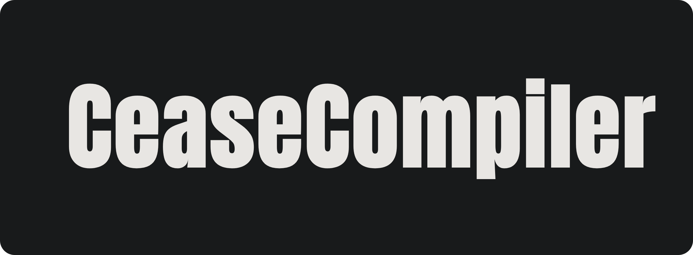

<p align="center">
  
</p>

<div align="center">
  <h3>The statically typed, low-level compiler</h3>
</div>

CeaseCompiler is a statically typed, compiled programming language written in C++, with a custom made lexer, parser, AST, semantic analysis, and LLVM-based code generation. It prioritises low-level integration along with simplicity over some safety features.

This repo is still in the early stages and is only a few weeks in the making, so features are still rapidly being added.

## Compiler Pipeline

```text
Source
  ↓
Lexer
  ↓
Parser
  ↓
Abstract Syntax Tree
  ↓
Semantic Analysis
  ↓
LLVM Intermediate Representation
  ↓
Executable
```

## Design Decisions

### Performance

This programming language is made for performance, and therefore garbage collectors are immediately disregarded.

LLVM is unmatched in terms of optimisation and is the obvious choice that the vast majority of modern programming languages use.

### Syntax

The syntax in the programming language aims to be close to C while balancing keystrokes, readability and traditional keywords.

No semicolons makes code more readable, and the error messages can still be decent.

For example, using `//` for comments, `int` for integers, and not implementing `i8` or `u8` like Rust, for example, because it introduces ambiguity and makes the code unreadable.

## Errors

Error messages are one of the most important parts of programming languages, as they are the difference between 5 minutes of debugging and multiple days' worth of debugging.

This programming language is built from the start with error messages in mind.

## Example Code

This code is what is currently implemented:

```cz
let x = -(2 * 8 - 4) / 2 // let is a temporary keyword used until types are implemented in a few days hopefully
let y = x + 2
exit(y - 1)
```

## Usage

Put your Cease code in a file, for example `main.cz`, then run:

```bash
cease main.cz
```

## TODO

* [x] integer literals
* [x] variables
* [x] variable references
* [x] unary expressions
* [x] binary expressions
* [x] operator precedence
* [x] parentheses
* [x] basic arithmetic
* [x] syntax error messages
* [x] undefined variable errors
* [x] error positions
* [x] comments
* [ ] scopes
* [ ] `<`, `>`, `==`, `!=`, `<=`, `>=`
* [ ] if/else/elseif/for/while
* [ ] types instead of let
* [ ] use LLVM IR
* [ ] More keywords like structs
* [ ] more advanced types
* [ ] pointers and adresses


## AI USAGE

This repository uses minimal AI assistance.

Absolutely **NO** code was AI generated.

AI was used to debug a few bugs that weren't found in a decent amount of time.

This README was run through AI for spellchecking, grammar and punctuation.

No AI was used in anything else.
